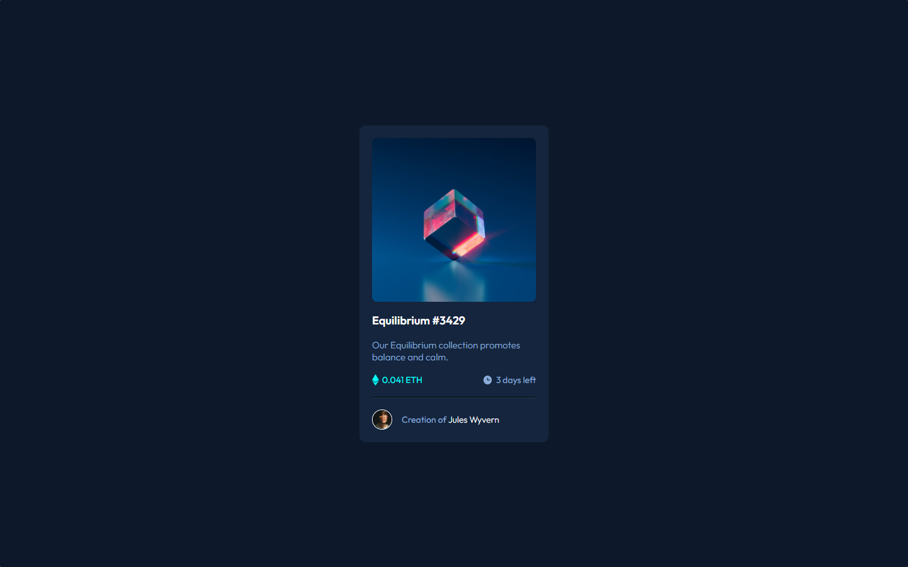
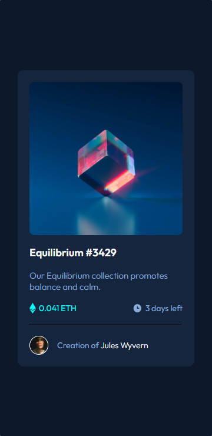

<h1 align="center">Componente NFT</h1>
<br>

<p align="center">Exercício resolvido para "testar" as habilidades de HTML e CSS após completar os módulos avançados do curso.</p> 
<br>

<div>
    <h3 align="center"><strong>Desktop View</strong><h3>
    <a href="https://thaleshng.github.io/nft-component/" target="_blank"></a> 
</div>

<div align="center">
    <h3 align="center"><strong>Mobile View</strong><h3>
    <a href="https://thaleshng.github.io/exercicio-menu-com-flexbox/" target="_blank"></a> 
</div>

<div align="center">
    
    
    <br>
    
    <br>
    
</div>

<br>


<div aling="center">
    <a href="#tecnologias-utilizadas">Tecnologias Utilizadas</a> •
    <a href="#finalidade-do-projeto">Finalidade do Projeto</a> •
    <a href="#dificuldades-encontradas-e-aprendizados">Dificuldades Encontradas e Aprendizados</a> •
    <a href="#como-ter-acesso-ao-código">Como ter acesso ao Código</a> 
</div>

<br>
<br>

<h2 align="center">Tecnologias Utilizadas</h2>
<br>

[](https://www.devmedia.com.br/o-que-e-o-html5/25820)
<br>
<br>

[](https://kenzie.com.br/blog/css3/)
<br>
<br>
<br>
<br>

<h2 align="center">Finalidade do Projeto</h2>
<br>

<p> O projeto em questão tem como finalidade testar os aprendizados dos módulos de HTML e CSS do curso de developer.</p> 
<p>A premissa do exercício em questão foi criar um Card NFT e centralizá-lo ao meio da página usando as ferramentas ensinadas no curso.</p>
<br>
<br>
<br>
<br>

<h2 align="center">Dificuldades Encontradas e Aprendizados</h2>
<br>

<p> No geral eu consegui atingir os objetivos que se pediam no exercício, contudo, não tive dificuldades quanto ao código, observei melhorias na prática do Clean Code e no alinhamento do conteúdo, a maior 'dificuldade' encontrada foi em relação aos espaçamentos dos elementos (margin e padding), visto  que, por ser um exercício do Frontend Mentor, esses valores não são dados.</p>
<p> Quanto ao 'problema' com os espaçamentos, foi resolvido usando algumas ferramentas para auxiliar na 'descoberta' dos tamanhos dos elementos como 'PerfectPixel' e 'LightShot', além de alguns espaçamentos que eu mesmo defini o valor, ao achar que seria melhor pra visualizar o projeto.<br>
Após o projeto finalizado, comparei o meu código ao código da resolução e destaquei os pontos onde podiam ser melhorados, para que os erros não voltem a acontecer nos próximos exercícios.
<br>
<br>
<br>
<br>

<h2 align="center">Como ter acesso ao Código<h2>
<br>

### Pré-requisitos:
<br>
Antes de começar, vai precisar ter instalado na sua máquina as seguintes ferramentas:
<br>
<br>

[Git Bash](https://git-scm.com)

[VS Code](https://code.visualstudio.com)
<br>
<br>

Clone este repositório com o Git Bash:
```
git clone https://github.com/thaleshng/nft-component.git
```
Entra na pasta que foi criada e abra com o Visual Studio Code.